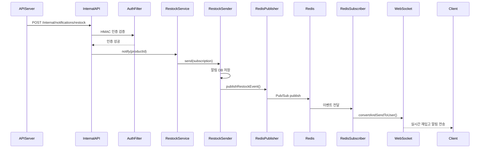
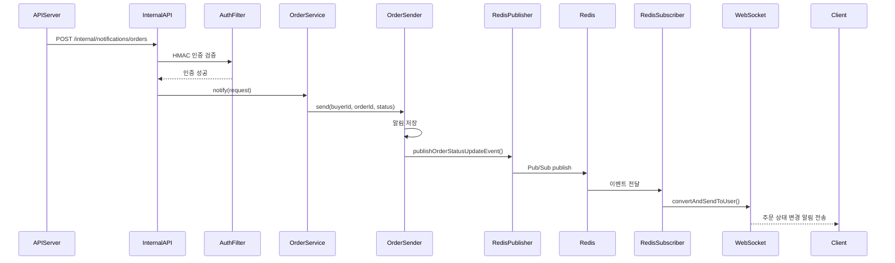
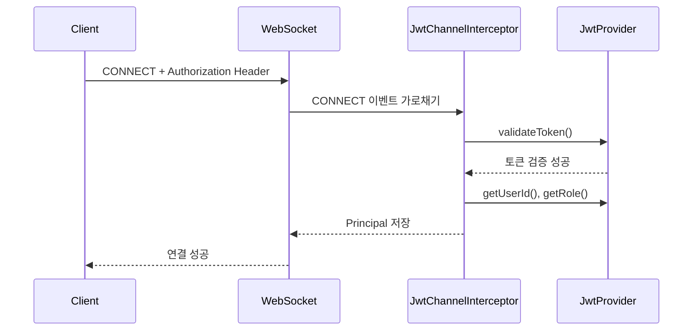
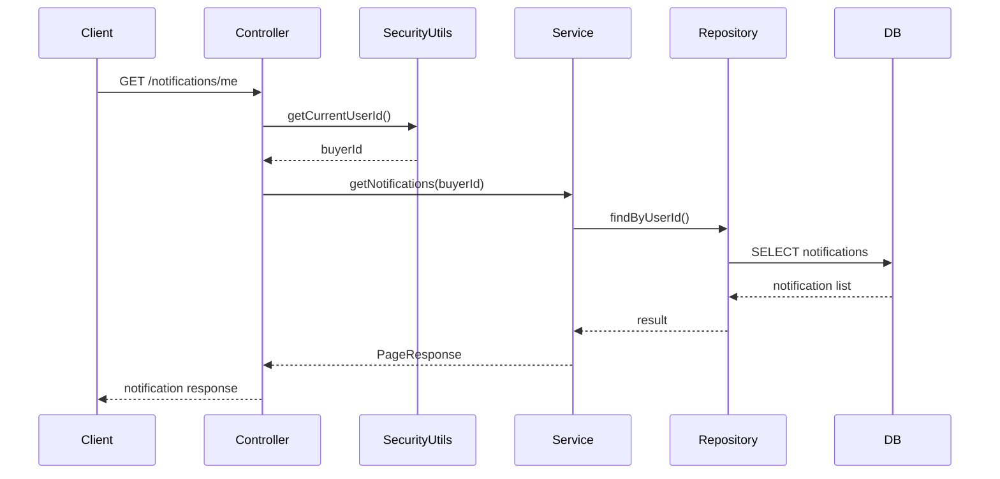
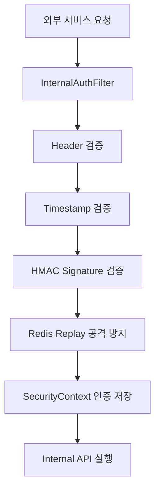

# 🖥️ 알림 서버

 

---

# 1. 📌 서버 개요

## 서버 소개

알림 서버는 멀티벤더 마켓플레이스 플랫폼의 알림 기능을 담당하는 서버입니다.
Redis Pub/Sub과 WebSocket을 활용하여 재입고 알림 및 주문 상태 변경 알림을 구매자에게 실시간으로 전달합니다.

 

---

# 2. 📡 주요 API

| Method | URI                      | Description     |
|--------|--------------------------|-----------------|
| POST   | /internal/notifications/restock | 재입고 알림 발송 API   |
| POST   | /internal/notifications/orders            | 주문 상태 알림 발송 API |

 

---

# 3. 🔄 서비스 플로우

## 재입고 알림

---

## 주문 상태 변경 알림

---

## WebSocket 인증 흐름

---

## Redis Pub/Sub 구조

---

## 알림 조회 및 읽음 처리 흐름

---

## Internal API 보안 흐름

---

# 4. 🗂️ ERD

 

---

# 5. 🧠 기술적 의사 결정

## WebSocket + Redis Pub/Sub 활용

### 배경

재입고 알림 기능에서 특정 구매자에게만 실시간 알림을 전송해야 했다. 
브로드캐스트가 아닌 개인 대상 알림이었기 때문에 STOMP의 User Destination을 활용한 구조가 필요했고, 멀티 서버 환경에서도 특정 사용자에게 정확히 메시지를 전달할 수 있는 방법이 필요했다.

### 기술 선택지

|비교 항목|HTTP Polling| SSE              |WebSocket + STOMP|
|--------|------------|------------------|------------------|
|통신 방식|단방향 (클라이언트 → 서버)| 단방향 (서버 → 클라이언트) |양방향|
|실시간성|낮음|중간|높음|
|서버 부하|높음 (반복 요청)|낮음|낮음|
|개인 알림 적합성|부적합|가능|적합|

| 비교 항목 | Spring SimpleBroker | Redis Pub/Sub   |
|-------|---------------------|-----------------|
| 세션 관리 | 서버 메모리              |중앙 브로커|
| 멀티 서버 대응| 불가                  |가능|
|수평 확장| 불가          |가능|

### 선택 이유

SSE는 서버→클라이언트 단방향 통신만 가능하다. WebSocket은 한 번 연결 후 양방향 통신이 유지되어 낮은 지연 시간과 실시간 Push가 가능하다.

Spring SimpleBroker는 세션을 서버 메모리에서만 관리하기 때문에, 재입고 알림 이벤트가 발생한 서버와 해당 사용자가 연결된 서버가 다를 경우 알림을 전달할 수 없는 문제가 발생한다. 
Redis Pub/Sub을 중앙 브로커로 두면 어느 서버에서 알림을 발행하더라도 모든 인스턴스가 수신하고, 해당 사용자의 세션을 보유한 서버만 실제로 전달하는 구조로 멀티 서버 환경에서도 안정적인 개인 알림 전송이 가능하다.

### 해결 및 결과

WebSocket + STOMP의 User Destination(`/user/queue/notifications`)을 활용해 특정 구매자에게만 알림을 전송하는 구조를 구현했고, Redis Pub/Sub 도입으로 멀티 서버 환경에서도 알림 유실 없이 정확한 사용자에게 전달할 수 있는 구조를 갖췄다.

 

---

## 내부 호출용 HMAC 서명 인증 및 전용 권한 처리

### 배경

고객/관리자 서버는 특정 이벤트가 트리거되면 알림 서버의 `/internal/**` 엔드포인트로 HTTP 요청을 보내 알림 생성 및 전송을 처리한다. 
이 엔드포인트가 `permitAll()`로 설정되어 있어 누구나 호출할 수 있었고, 인증·서명 검증·레이트 제한이 전혀 없어 악의적 호출로 대량 알림 스팸이 유발될 수 있었다.

### 기술 선택지

|비교 항목|API Key 방식|HMAC 서명 방식|
|---|---|---|
|위변조 방지|불가 (탈취 시 그대로 재사용 가능)|가능 (body 포함 서명으로 변조 감지)|
|재전송 공격 방어|불가|가능 (timestamp + requestId 검증)|
|구현 복잡도|낮음|중간|

### 선택 이유

API Key 방식은 구현이 단순하지만 탈취 시 무한 재사용이 가능하고 요청 본문의 위변조를 감지할 수 없다. 
HMAC 서명 방식은 `timestamp + requestId + body`를 secret으로 서명하기 때문에 요청 본문이 조금이라도 변조되면 검증에 실패하고, timestamp로 만료된 요청을, requestId로 재전송 공격을 방어할 수 있어 내부 서버 간 통신 보안에 적합하다.

### 해결 및 결과

발신 서버(고객/관리자 서버)는 `timestamp + requestId + body`를 공유 secret으로 서명한 뒤 `X-Client-Id`, `X-Timestamp`, `X-Request-Id`, `X-Signature` 헤더에 담아 전송한다. 알림 서버의 `InternalAuthFilter`에서는 헤더 누락 여부, 클라이언트 ID, 타임스탬프 유효성(300초 이내), 서명 일치 여부를 순서대로 검증하고, Redis의 `setIfAbsent`로 동일한 requestId의 재전송 공격까지 차단한다. 
검증을 통과한 요청에는 `ROLE_INTERNAL_CLIENT` 권한을 부여해 내부 전용 엔드포인트에만 접근할 수 있도록 했다. 
이를 통해 서명된 요청만 처리되어 위변조 방지와 요청 신뢰성이 보장되었다.

 

---

# 6. 🚨 트러블 슈팅

## STOMP Subscribe 프레임에서 accessor.getUser() 가 null 이 되는 문제

### 문제

`CONNECT` 프레임에서는 `accessor.getUser()`가 정상적으로 존재했지만, 이후 `SUBSCRIBE` 프레임에서는 `null`로 확인되어 `convertAndSendToUser()`가 메시지를 전달할 세션을 식별하지 못할 가능성이 있었다.

### 원인

`CONNECT`와 `SUBSCRIBE`의 `sessionId`가 동일함을 확인해 재연결 문제는 아니었고, 같은 세션 안에서 `Principal`만 유지되지 않는 것이 문제였다.

- 기존 코드는 `StompHeaderAccessor.wrap(message)` 방식으로 accessor를 가져오고 있었다.
- 이 방식은 메시지에 실제로 연결된 accessor를 가져오는 것이 아니라 새 wrapper를 생성하기 때문에, `Principal`과 같은 session-bound header 상태가 이후 처리 흐름에 유지되지 않았다.

### 해결

`StompHeaderAccessor.wrap()` 대신 `MessageHeaderAccessor.getAccessor()`를 사용해 메시지에 이미 연결된 accessor를 직접 가져오도록 수정했다.

- `StompHeaderAccessor.wrap(message)` → `MessageHeaderAccessor.getAccessor(message, StompHeaderAccessor.class)` 로 변경했다.
- `accessor.setLeaveMutable(true)`를 추가하고, 변경된 헤더를 포함한 새 메시지를 반환하도록 수정했다.
- `UserPrincipal`의 `getName()`이 `convertAndSendToUser()`에서 사용하는 userId 문자열과 일치하도록 구현했다.

### 결과

`SUBSCRIBE` 프레임에서 사용자 정보가 정상적으로 유지되었고, `/user/queue/notifications` 구독 세션에 인증된 사용자 정보가 연결되어 특정 고객에게 실시간 알림을 정상적으로 전송할 수 있게 되었다.

 

